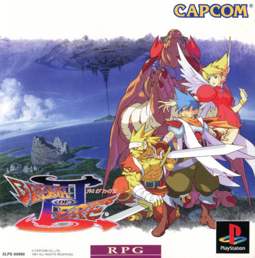

# Breath of Fire III Recompiled

<!-- retcomm-readme-metrics -->
[](https://github.com/TechnicallyComputers/BreathOfFire3Recomp/releases)
[](https://github.com/TechnicallyComputers/BreathOfFire3Recomp/releases/latest)
[](https://github.com/TechnicallyComputers/BreathOfFire3Recomp/releases/latest)
<!-- /retcomm-readme-metrics -->


<!-- retcomm-readme-boxart -->
<p align="center">
  
</p>
<!-- /retcomm-readme-boxart -->

A **static recompilation** of Capcom's 1997 PlayStation RPG *Breath of Fire III*
— Japanese release, SLPS-00990. The game's MIPS R3000A machine code is
translated ahead of time into C, then compiled into a native executable. This is
not an emulator: there is no interpreter in the hot path, and the game's own code
becomes your CPU's code.

Built on [psxrecomp](https://github.com/mstan/psxrecomp) and
[recomp-ui](https://github.com/mstan/recomp-ui), both pinned as submodules.

| | |
|---|---|
| Title | Breath of Fire III |
| Serial | SLPS-00990 |
| Region | Japan |
| Publisher | Capcom |
| Year | 1997 |
| Players | 1 |
| Boot EXE | `SLPS_009.90` |

> **This project ships no game content.** You must supply your own legal disc
> dump. See [Legal](#legal).

## Status

**Pre-alpha — boots and renders, not playable through yet.** The game reaches
its title screen, accepts input, and plays its opening prologue with text
drawing correctly. It has not been played end to end.

What works:

- [x] Full toolchain: emitters → generate → native runtime, all stages clean
- [x] Disc verification against known MD5/SHA-1/size
- [x] **Recompilation is clean under `strict = true`** — 2.5M lines across 35
      shards with **zero skipped functions and zero unsupported instructions**
- [x] Function discovery grows 523 seed targets → **1467** dispatch entries
- [x] Boots into game code with a live stack and a healthy vblank/IRQ path
- [x] **Renders.** Title screen and opening prologue, ~1.2M GPU draw commands,
      double-buffered, 3D geometry submitting
- [x] **Input.** Start advances the title screen; the buffer flip engages
- [x] **Savestates.** Save and load, round-trip verified on the LLE backend

What does not work yet:

- [ ] Not played past the opening — no soak coverage of real gameplay
- [ ] Overlay discovery and loading
- [ ] Audio, video output, save/memcard verification
- [ ] JP→EN runtime string translation — the script has been located on disc
      (see below), but the runtime cannot yet identify which code draws text

### A correction worth recording

Earlier revisions of this file reported that boot "parks in a wait loop" before
rendering, with a stalled CD-ROM read as the leading hypothesis. **That was
wrong and is retracted.** The two pinned program counters are `DrawOTag()` and
`VSync()` — a healthy render loop, not a stall.

The game had been drawing its title screen all along. What hid it: Release
builds compile with `PSX_DEBUG_TOOLS=OFF`, which strips the TCP debug server, so
there was no way to look at the screen and the diagnosis rested on inference
from a heartbeat file. Building with `-DPSX_DEBUG_TOOLS=ON` and capturing a
frame settled it in minutes.

Two traps that cost time, recorded so they don't cost it again: `--headless`
with the OpenGL renderer screenshots **black** (there is no GL context — use
`--renderer software`), and the debug command is `gpu_state`, not `gpu`.

### Localization research

The Japanese script does **not** live in the boot executable. It sits in
per-area `.EMI` container sections — specifically the section whose destination
address is `0x80010000`, a selector that resolves unambiguously across all 880
`.EMI` files on the disc. The script is loaded into RAM by CD-ROM DMA.

This matters because it means translation work aligns by file and slot rather
than by address. Details in [`docs/LOCALIZATION.md`](docs/LOCALIZATION.md).

The open problem is not extracting text but *applying* it: the framework's
substitution hook expects a string pointer in an argument register at a call
boundary, and this game does not pass text that way. Identifying the text-draw
code is the next task.

Current state, evidence, and next actions live in
[`docs/STATUS.md`](docs/STATUS.md), [`docs/BRINGUP.md`](docs/BRINGUP.md), and
[`docs/LOCALIZATION.md`](docs/LOCALIZATION.md). Claims in those docs cite the
trace or run that established them — that is the project's standard, inherited
from the framework.

## Requirements

### You must own the game

This repository contains **no game code, assets, or disc data**, and never will.
You need your own legal dump of Breath of Fire III (Japan). `.bin`/`.cue`/`.iso`
files are gitignored and must never be committed.

A retail PlayStation BIOS is **not** required and is not redistributed — the
build uses OpenBIOS by default. You may supply your own SCPH dump locally with
`--bios` if you prefer.

### Toolchain

| Tool | Version built against | Notes |
|---|---|---|
| GCC / G++ | 16.2.0 | Default compiler |
| Clang | 22.1.8 | Optional alternative |
| CMake | 4.4.2 | ≥ 3.20 required |
| Ninja | 1.13.2 | Generator used throughout |
| ccache | 4.14 | Optional; greatly speeds rebuilds |
| SDL3 | 3.4.14 | Default backend; CMake falls back to `FetchContent` without a system package |
| SDL2 | 2.32.10 | Only for `-DPSX_SDL_BACKEND=SDL2` |
| Python | 3.14 | Needs `tomllib` |

Linux/macOS equivalents are in `psxrecomp/docs/BUILDING.md`.

## Setup

### Windows

Windows uses **MSYS2 MinGW-w64**, the toolchain `psxrecomp/docs/BUILDING.md`
recommends for release parity.

```powershell
winget install --id MSYS2.MSYS2 --exact
```

```bash
# In the MSYS2 shell. Run -Syu twice: the first pass upgrades msys2-runtime
# and closes the shell before the rest of the update can apply.
pacman -Syu --noconfirm
pacman -Syu --noconfirm

pacman -S --needed --noconfirm \
  mingw-w64-x86_64-toolchain mingw-w64-x86_64-cmake mingw-w64-x86_64-ninja \
  mingw-w64-x86_64-ccache mingw-w64-x86_64-clang \
  mingw-w64-x86_64-sdl3 mingw-w64-x86_64-SDL2
```

Mind the SDL casing: SDL3 is lowercase `sdl3`, SDL2 is uppercase `SDL2`. pacman
aborts the entire transaction on one unknown target, so a single typo installs
nothing at all rather than partially succeeding.

MSYS2 does not put its tools on the system `PATH`. **Every build shell needs:**

```bash
export PATH=/c/msys64/mingw64/bin:$PATH
```

That one prepend supplies the compilers, CMake, Ninja *and* a working `python3`.
Two Windows traps it avoids:

- Without it, bare `python3` hits the Microsoft Store alias stub, which prints
  "Python was not found" and exits **9009**. It resolves as a command, so
  scripts see it as present and then fail confusingly.
- `C:\msys64\usr\bin\bash.exe` is the **MSYS** environment, a different prefix —
  it has neither `python` nor `cmake`. Use Git Bash with the prepend above, or
  the MSYS2 **MINGW64** shell.

### Build

Place your dump in `isos/` (gitignored), then:

```bash
export PATH=/c/msys64/mingw64/bin:$PATH   # Windows only
git submodule update --init --recursive
./psxrecomp/tools/ci/build_emitters.sh
python3 psxrecomp/psxrecomp_cli.py generate \
  --config game.toml --project-root . \
  --disc "isos/Breath of Fire III (Japan).cue"
cmake -S . -B build-release -G Ninja -DCMAKE_BUILD_TYPE=Release
cmake --build build-release --target psx-runtime
```

The emitter step is a shell script, so on Windows run the loop from **Git Bash**
or the MSYS2 MINGW64 shell rather than PowerShell.

`[game].disc` in `game.toml` is **repo-relative** (`isos/…cue`) and resolves
against the detected project root, so it works from any checkout and from
`build-release/` without editing. Only the filename needs to match your dump.

Generating takes a while — it emits ~2.5M lines of C, and the first compile of
that is the long pole. `ccache` makes subsequent rebuilds much cheaper.

### Run

The build produces `build-release/BreathOfFire3_Recompiled.exe`.

```bash
cd build-release
./BreathOfFire3_Recompiled.exe                      # launcher
./BreathOfFire3_Recompiled.exe --headless --no-launcher   # CI / soak
```

Flags are parsed in `psxrecomp/runtime/src/main.cpp`: `--bios`, `--game`,
`--disc`, `--debug-port`, `--memcard-dir`, `--renderer`, `--window-title`,
`--launcher`, `--no-launcher`, `--headless`, `--netplay`, `--net-*`.

> `--help` is **not** a recognized flag. The runtime ignores unknown arguments
> and launches normally, so `--help` opens a window instead of printing usage.

`--headless` implies `--no-launcher`, opens no window or audio device, and
suppresses blocking modal dialogs — it is the right frontend for unattended
soak runs. A hung or slow run writes `psx_freeze_heartbeat.json` next to the
executable.

> **A Release build cannot be inspected.** `PSX_DEBUG_TOOLS` defaults **off**
> for Release, which compiles out the TCP debug server entirely — `--debug-port`
> is silently inert and the heartbeat file is your only diagnostic. This cost a
> misdiagnosis once already (see [Status](#status)).

For anything diagnostic, build a second tree with the tools enabled:

```bash
cmake -S . -B build-dbg -G Ninja -DCMAKE_BUILD_TYPE=Release -DPSX_DEBUG_TOOLS=ON
cmake --build build-dbg --target psx-runtime
```

That build serves a JSON debug server (default port 4370) offering screenshots,
GPU state, RAM reads, write tracing, input injection and savestates.
`tools/playsession.py` wraps the common operations:

```bash
python tools/playsession.py status          # frame, GPU state, armed traces
python tools/playsession.py shot out.png    # needs --renderer software
python tools/playsession.py state save 1    # savestate slot 1
```

Screenshots require `--renderer software`; with OpenGL in headless there is no
GL context and captures come back black.

<!-- retcomm-readme-launcher -->
## RetComM Launcher

You can run this title **standalone** (release zip + the built-in recomp-ui
Generate & Build flow), or manage installs, updates, ROM/BIOS wiring, and queued
builds more intuitively with
**[RetComM Launcher](https://github.com/TechnicallyComputers/RetComM-Launcher)** —
the Retro Compilation Manager hub for self-compiling recomps.

[Downloads](https://github.com/TechnicallyComputers/RetComM-Launcher/releases) ·
[Full README & features](https://github.com/TechnicallyComputers/RetComM-Launcher#readme)

<p align="center">
  
</p>

<p align="center">
  
</p>

RetComM checks for updates, rebuilds with existing build data when possible,
shares the portable toolchain used by per-title launchers, and automates
BIOS/ROM/save plumbing so you are not stuck repeating each game’s wizard by hand.
<!-- /retcomm-readme-launcher -->

## Project structure

```
game.toml              title config — identity, digests, recompiler, runtime, localization
game_options.toml      native in-game OPTION persistence (template)
symbols.toml     ──▶   tools/sync_symbols.py  ──▶  psx_symbols.h  (PSX_FN_*)
seeds/                 ghidra_funcs.txt — recompilation seed targets
codegen_setup.c/.h     setup-wizard host wiring
CMakeLists.txt         psxrecomp_add_game_runtime(psx-runtime …)
catalog_identity.json  marketing + ROM identity for launcher catalogs
docs/                  title-owned notes — STATUS, BRINGUP, LOCALIZATION
tools/                 sync_symbols.py, plus disc/EMI/disasm/session helpers
isos/                  your legal dump          (gitignored, never committed)
disc/                  staged boot EXE          (gitignored)
generated/             recompiled C output      (gitignored)
build-recompiler/      emitter binaries         (gitignored)
build-release/         native runtime           (gitignored)
build-dbg/             runtime + debug server   (gitignored, -DPSX_DEBUG_TOOLS=ON)
psxrecomp/             SUBMODULE — framework    (read-only here)
recomp-ui/             SUBMODULE — launcher     (read-only here)
```

### How it works

1. **Emitters build.** `psxrecomp-game` and `psxrecomp-bios` are compiled from
   the framework submodule.
2. **Generate.** The boot EXE is parsed, functions are discovered by following
   JAL targets to closure from the seed list, and each is translated to C.
   OpenBIOS is recompiled the same way. `strict = true` means anything the
   translator cannot faithfully express **aborts loudly** rather than emitting
   a stub.
3. **Native build.** The generated C is compiled and linked against the
   framework runtime — which simulates the GPU, SPU, CD-ROM, DMA, timers, and
   interrupt controller — plus the recomp-ui launcher.
4. **Run.** The result is a native executable that mounts your disc, verifies
   it, and executes the game's own translated code.

## Symbols

Progressive symbol map — discover, label, then manipulate via `PSX_FN_*`:

```bash
python3 tools/sync_symbols.py    # symbols.toml → psx_symbols.h
```

Never hand-edit `psx_symbols.h`; it is generated. Gate `emit = true` only when
an entry is safe to own. See `psxrecomp/docs/SYMBOLS.md`.

## Framework pins

Submodule gitlinks (`psxrecomp`, `recomp-ui`, nested `recomp-net`) are
authoritative. `framework_pins.txt` is an optional scaffold snapshot; release CI
logs SHAs with `record_pins.sh` but builds whatever the gitlinks resolve to.
Bump submodules deliberately — never float on `main`/`master` in release CI.

The framework submodules are **read-only from here**. Fixes to psxrecomp or
recomp-ui belong upstream in their own repositories, not as local patches.

## Documentation

| Doc | Contents |
|---|---|
| [`docs/STATUS.md`](docs/STATUS.md) | Living status — where the project stands, what's in flight, what's blocked |
| [`docs/BRINGUP.md`](docs/BRINGUP.md) | Boot/soak log — what runs, where it stops, what was fixed |
| [`docs/LOCALIZATION.md`](docs/LOCALIZATION.md) | JP→EN: where the script lives on disc, the `.EMI` container, what blocks applying a translation |
| [`docs/INVENTORY.md`](docs/INVENTORY.md) | What is actually in this repo |
| [`docs/README.md`](docs/README.md) | Documentation conventions |
| `CLAUDE.md` | Session bootstrap for AI agents working in this repo |

Framework reference lives in `psxrecomp/docs/` — `GAME_PROJECT_SETUP.md`,
`BUILDING.md`, `SYMBOLS.md`, `STRING_TRANSLATION.md`, `overlay-discovery.md`,
`FUNCTION_DISCOVERY.md`, `config_schema.md`, `TESTING.md`.

## Contributing

The highest-value contributions right now, in order:

1. **Play it and find where it breaks.** The game boots and renders but has
   never been played through. Crashes, hangs, and wrong output are all useful.
   Use a `build-dbg` tree so the run can be inspected live rather than
   post-mortem, and say roughly which frame and which area.
2. **Find the text-draw code.** The blocker for localization: identify which
   functions render on-screen text. The framework's substitution hook expects a
   string pointer in an argument register at a call boundary and this game does
   not pass text that way, so a new approach is needed — reads of the script
   buffer at `0x80010000` are not visible to the existing MMIO read tracer.
3. **Overlay archaeology.** BoF3 streams overlays from disc; mapping them is
   the next milestone.
4. **Reverse engineering.** Identify functions and record them in
   `symbols.toml` with the rationale for how they were identified.

Ground rules:

- **You must legally own the game.** Never commit disc data, BIOS dumps, or
  ripped assets — not as files, not pasted into a document or commit message.
- **No stubs.** A function is fully implemented or it fails loudly. `return 0;`,
  `// TODO`, and `// for now` are all stubs.
- **Evidence over assertion.** Accuracy claims are cross-referenced against an
  external comparative — psx-spx, the in-tree Beetle oracle, DuckStation, or
  hardware test ROMs — not asserted.
- **No per-game hacks during foundation work.** If the recompiler or the
  hardware simulation is wrong, fix *that*. Per-title shims become legitimate
  only in the enhancement phase, after the faithful core is proven.
- **Disclose AI assistance** in pull requests.

## AI-assisted development

Parts of this project — bringup diagnosis, documentation, and configuration —
are developed with AI assistance. Generated work is held to the same standard as
everything else: it is verified against real runs and real traces before it is
committed, and findings cite the evidence that established them. AI output that
cannot be verified does not land.

## Legal

This is a **clean-room recompilation project**. It contains no game code,
assets, text, audio, or disc data, and it never will.

**Not included and not distributed:**

- Breath of Fire III — its code, assets, text, audio, or disc images. Those
  remain the property of **Capcom Co., Ltd.**
- Any PlayStation BIOS image. Those rights are Sony Interactive Entertainment's.
  The build uses OpenBIOS instead.

**Tracked in this repository:** build configuration, recompilation seeds
(addresses only), symbol maps, tooling, documentation, and host glue code.

Running this software requires a disc dump you produced from your own legally
purchased copy. Obtaining the game any other way is your responsibility, not
this project's.

Licensed under the **PolyForm Noncommercial License 1.0.0** — see
[`LICENSE`](LICENSE). Noncommercial use is welcome; commercial use is not
granted. The framework this builds on, psxrecomp, is licensed the same way;
recomp-ui is MIT. Each submodule retains its own terms.

Default app icon: `assets/psxrecomp.ico` (and `.png` / `.svg`) — RetComM-themed
controller mark from `psxrecomp/assets/`. Windows builds embed it via
`APP_ICON`. Optional box art under `launcher_assets/img/` may come from
[libretro-thumbnails](https://github.com/libretro-thumbnails/libretro-thumbnails)
(`Named_Boxarts`); see `BOXART_SOURCE.txt` when present.

Breath of Fire is a trademark of Capcom Co., Ltd. This project is not
affiliated with, endorsed by, or sponsored by Capcom or Sony Interactive
Entertainment.

## Acknowledgments

- **[mstan](https://github.com/mstan)** — for
  [psxrecomp](https://github.com/mstan/psxrecomp) and
  [recomp-ui](https://github.com/mstan/recomp-ui), the framework and launcher
  this title is built on.
- The **[OpokXeno/xenogears-recomp](https://github.com/OpokXeno/xenogears-recomp)**
  project, whose repository served as the model for this README.
- The PSX documentation community — **psx-spx** above all — without which none
  of the hardware simulation would be verifiable.

<!-- retcomm-readme-raid -->
---

<p align="center">
  <sub><b>R.A.I.D. — Retro AI Development</b> · a Discord for AI-assisted retro reverse-engineering, decomp &amp; recomp</sub>
</p>

<p align="center">
  <a href="https://discord.gg/Ad9BwSzctP"></a>
</p>
<!-- /retcomm-readme-raid -->
